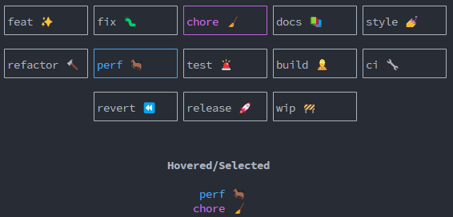

<p align="center"></p>

<br>


<p align="center"><b>matetui</b> » set of utilities for creating <i>Terminal User Interfaces</i>
using <a href="https://ratatui.rs" target="_blank"><code>ratatui</code></a> and
<a href="https://tokio.rs" target="_blank"><code>tokio</code></a></p>


<br>

# Usage

This library provides a small framework for building async terminal user interfaces (**TUI**) using
a component-based architecture, based on the `ratatui` library and the `tokio` runtime.

It defines two primary elements:
- the `App` struct, 
- and the `Component` trait.
 
Together, these elements facilitate the creation of modular and interactive terminal applications.

See the example at 
[`examples/matetui/main.rs`](https://raw.githubusercontent.com/lucodear/matetui/master/examples/matetui/main.rs)
for a demonstration of how to use this library to build a TUI application.

```rust
use matetui::{component, Component, ComponentAccessors, Action};

#[tokio::main]
async fn main() -> Result<(), Box<dyn std::error::Error>> {
    // the `Home` component is the root component of the app
    let home = Home::default().as_active();

    let mut app = App::default()
        .with_components(components![home]) // add the root component to the app
        .with_keybindings(kb![              // define keybindings
            "<ctrl-c>" => Action::Quit,     // quit the app when pressing ctrl-c
            "<q>" => Action::Quit,          // quit the app when pressing q
            "<d>" => "app:custom"           // send custom message when pressing d (all components will
                                            // receive this message and act accordingly)
        ])
        .with_tick_rate(24)                 // set the tick rate to 24 ticks per second
        .with_frame_rate(24);               // set the frame rate to 24 frames per second

    app.run().await?; // run the app

    Ok(())
}

component! {
    // mandatory struct definition
    pub struct Home {
        ...
    },

    // optional children definition
    children => {
        "child" => ChildComponent::new()
    }
}

impl Component for Home {
    fn receive_message(&mut self, message: String) {
        match message.as_str() {
            "app:custom" => self.react_to_it(),
            _ => {}
        }
    }

    // render logic
    fn draw(&mut self, f: &mut matetui::Frame<'_>, area: ratatui::prelude::Rect) {
        let child = self.child_mut("child").unwrap(); // get a child component
        draw.draw(f, right); // draw the child component
    }
}

```

### `App` Struct

The [`App`] struct represents the main application and it's responsible of (among other things):

- **Tick Rate and Frame Rate**: Controls the update frequency of the application.
- **Component Management**: Manages a collection of components that make up the user interface.
- **Event Bus**: Processes user inputs and dispatches actions to the components.
- **Lifecycle Management**: Handles the start and termination of the application.

### `Component` Trait

The [`Component`] trait represents a visual and interactive element of the user interface.

Components can be nested, allowing for a hierarchical structure where each component can have child
components. This trait provides several methods for handling events, updating state, and rendering:

- **Event Handling**: Methods like `handle_frame_event` and `handle_key_event` allow components
  to respond to different types of events.
- **State Management**: Methods like `update` and `receive_message` enable components to update
  their state based on actions or messages.
- **Rendering**: The `draw` method is responsible for rendering the component within a specified
  area. All components must implement this method to display their content.

## How It Works

### Component-Based Architecture

The framework uses a component-based architecture, where the user interface is composed of multiple
components. Each component can have child components, forming a tree-like structure. This design
promotes modularity and reusability, making it easier to manage complex user interfaces in a 
structured and standardized way.

### Interaction Between `App` and `Component`

- **Initialization**: The `App` initializes all components and sets up the necessary event channels.
- **Frame Rate and Tick Rate**: The `App` sets the frame rate and tick rate for the application and
  triggers the appropriate events at the specified intervals.
- **Event Dispatching**: The `App` listens for user inputs and dispatches actions to the relevant
  components.
- **State Updates**: Components update their state based on the actions they receive and can
  propagate these updates to their child components.
- **Rendering**: Components handle their own rendering logic, allowing for a flexible and
  customizable user interface.


Usually, the `App` is provided with a root component that represents the main component of the
application.

From the Main/Root component, the application can be built by nesting child components as needed in
a tree-like structure. Example:

```txt
App
└── RootComponent
    └── Router
        ├── Home
        │    ├── Header
        │    └── Content
        ├── About
        │    ├── Header
        │    └── Content
        └── Contact
             ├── Header
             └── ContactForm
```

In this example, the `RootComponent` is the main component of the application and contains a
`Router`, which is another component that manages the routing logic. The `Router` component has
three child components: `Home`, `About`, and `Contact` and will render the appropriate component
depending on the current route.

Then, heach "route" component (`Home`, `About`, `Contact`) can have its own child components, such
as `Header`, `Content`, and `ContactForm` and use them to build the final user interface.

The `RootComponent` will call the `draw` method of the `Router` component, which will in turn call
the `draw` method of the current route component (`Home`, `About`, or `Contact`), and so on.

The `draw` chain will propagate down the component tree, allowing each component to render its
content. The `App` starts the draw chain a few times per second. The amount of draw calls per second
is controlled by the `frame_rate` of the `App`:

```rust
let mut app = App::new(...).with_frame_rate(24); // 24 frames per second
```

Some tasks might be too expensive to be performed on every frame. In these cases, the `App` alsp
defines a `tick_rate` that controls how often the `handle_tick_event` method of the components is
called.

The tick event is often used to update the state of the components, while the frame event is used to
render the components in the terminal.

For example, a tick rate of 1 means that the `handle_tick_event` method of the components will be
called once per second. And a component might use this event to update its state, run background
tasks, or perform other operations that don't need to be done on every frame.

```rust
let mut app = App::new(...).with_tick_rate(10); // 10 ticks per second
```

### Component Communication

Components can communicate with each other using messages. The `Component` trait defines the 
following methods:

- `receive_message`: receives a message from the bus.

When a component wants to send a message to another component, it can use the sender it received
during the registration process.

```rust
self.send("an:custom:message");

// or using app-level actions
self.send_action(Action::Quit);
```

## Widgets

Apart from the tui framework, this library also provides a set of reusable "ratatui-native" widgets
that can be used. Theese are not components, but Widgets, just like native `Paragraph`, `Block`,
etc.

Right now, the following widgets are available:

### `TextArea`

This is a rip-off of the `TextArea` widget from the
[`tui-rs`](https://github.com/rhysd/tui-textarea) crate, but with less capabilities. In summary,
search, mouse support, copy, paste, and undo/redo functionalities were stripped off.

This implementation also changes the default key bindings to be more similar to the ones used in
the `coco` package (conventional commit cli utility). That is:

- <kbd>Enter</kbd> won't add a new line. **why?** Because that way, we can use the <kbd>Enter</kbd>
  key to submit the "form" or cofirm the input.
- Removes all key bindings of stripped functionalities.

#### Validation

In this implementation, the `TextArea` widget also supports validation. The validation is done by
accepting any number of validator functions that will be called every time the validity of the
text-area is checked.

One can add as many validation functions as needed:

```rust
textarea..with_validations(vec![
    |input: &str| {
        if input.len() > 10 {
            Err(format!("Input must be less than 10 characters"))
        } else {
            Ok(())
        }
    },
    required_validator,
]);
```

## `GridSelector` Widget

A selector restful widget that can be used to select items from a list. The items are displayed in a
grid, and the user can navigate through them using, for example, the arrow keys.



### Example

See the [`widget_grid_selector.rs`](https://raw.githubusercontent.com/lucodear/matetui/master/examples/widget_grid_selector.rs) example for a full 
demonstration of how to use the `GridSelector` widget.

In summary, the widget uses a `GridSelectorState` to keep track of the items and the state of the
widget.

The `GridSelectorState` takes a list of `GridItem`, which is a basic struct that encapsulates a 
`String` value.

The `GridSelectorState::new` method accepts a list of any type that can be converted to a 
`GridItem`:

```rust
pub fn new<I, T>(items: I) -> Self
  where
    I: IntoIterator<Item = T>,
    T: Into<GridItem>, // Accept anything that can be converted into GridItem
  {
    ...
  }
}
```

As a part of this library, the `Into<GridItem>` trait is implemented for `String`, `&str`.

The example at [`widget_grid_selector.rs`](https://raw.githubusercontent.com/lucodear/matetui/master/examples/widget_grid_selector.rs) demonstrates how to
implement the `Into<GridItem>` trait for a custom type.

## `Switch` Widget

A simple stateless switch widget that can be used to show visual feedback of a boolean state.

- On
  


- Off
  


### Example

See the [`widget_switch.rs`](https://raw.githubusercontent.com/lucodear/matetui/master/examples/widget_switch.rs) example for a full demonstration of how to
use the `Switch` widget.

